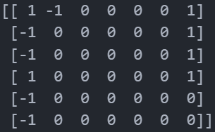

# Connect4 DQN MLOps project

Using DQN to train a model to play Connect4 against a player.
There will have integreted MLOps tools like advanced config, versioning, tests pipeline, and API.

Example of basic model version :



-1 : Newbie player, 1 model


To edit precisly the config, edit `config.json` file.

To run tests :
```
pytest --spec
```

To use api to play against the model :
(in coming)