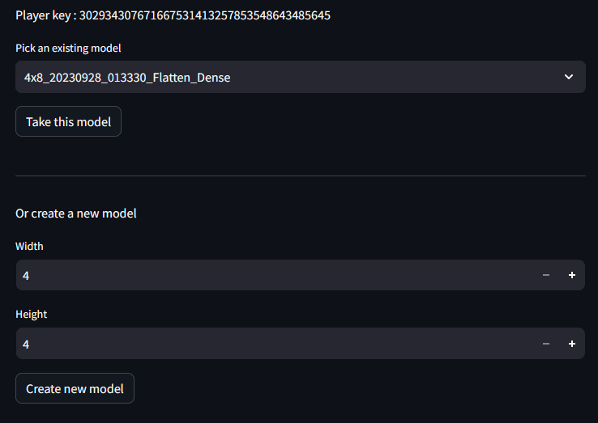
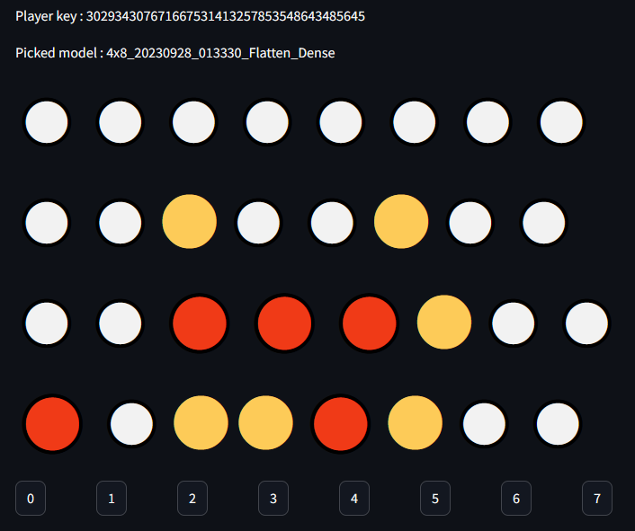
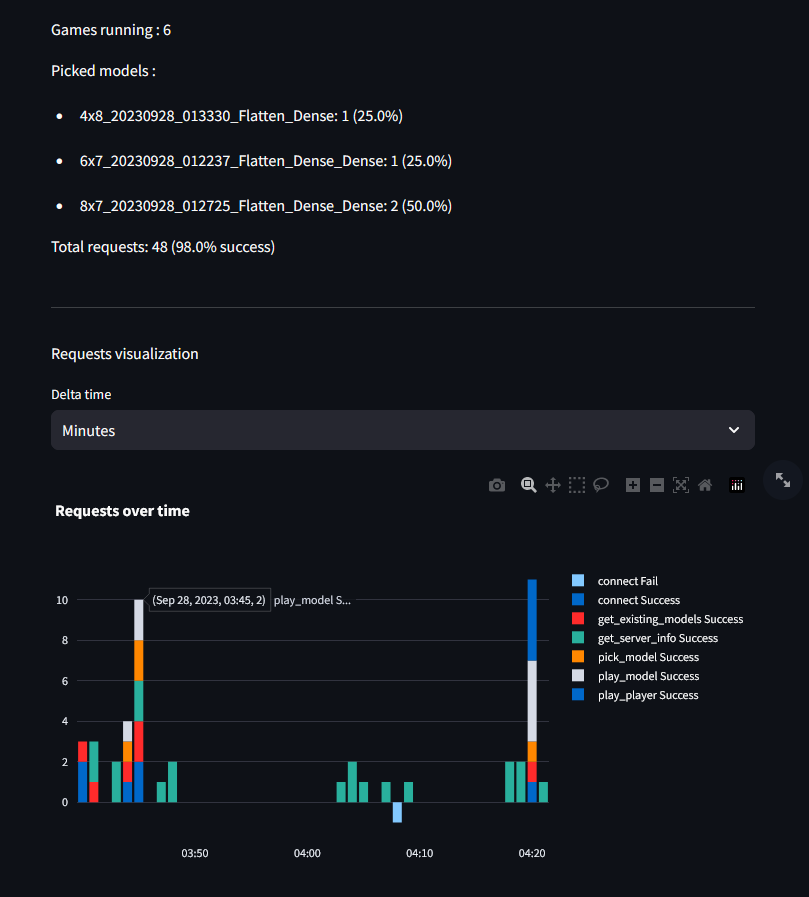

# Connect4 DQN MLOps project

Using DQN to train a model to play Connect4 against a player.
There will have integreted MLOps tools like advanced config, versioning, tests pipeline, API, front.

### Client screens

Pick a model :

Play game :

Check server monitoring

### To use it

- To edit precisly the config, edit `config.json` file.
- To run tests : `pytest -x -s --spec test_ci.py`
- To run client : `streamlit run client.py`
- To run the server : `flask --app server run`